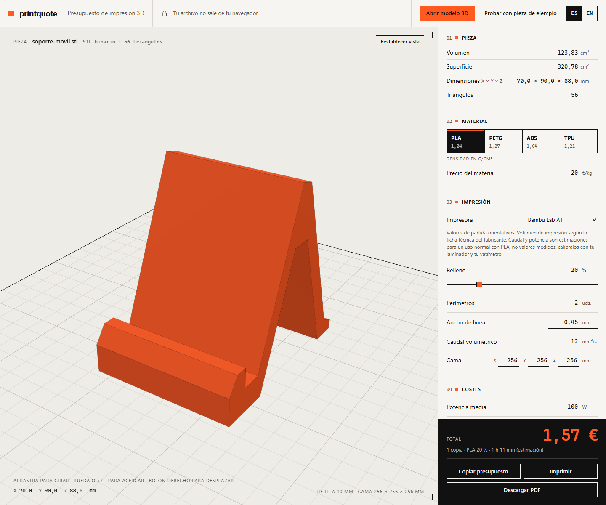

# Guía de uso de printquote

Esta guía explica, paso a paso y sin jerga, cómo sacar un presupuesto de impresión 3D con [printquote](https://bertmarti.github.io/printquote/). No necesitas instalar nada ni crear una cuenta.



## Índice

1. [Qué es printquote](#1-qué-es-printquote)
2. [Probar con la pieza de ejemplo](#2-probar-con-la-pieza-de-ejemplo)
3. [Abrir un modelo 3D (STL, OBJ y 3MF)](#3-abrir-un-modelo-3d-stl-obj-y-3mf)
4. [Manejar el visor 3D](#4-manejar-el-visor-3d)
5. [Leer la ficha de la pieza y los avisos](#5-leer-la-ficha-de-la-pieza-y-los-avisos)
6. [Elegir material y precio](#6-elegir-material-y-precio)
7. [Parámetros de impresión](#7-parámetros-de-impresión)
8. [Energía y margen](#8-energía-y-margen)
9. [Copias](#9-copias)
10. [Copiar, imprimir y descargar el presupuesto en PDF](#10-copiar-imprimir-y-descargar-el-presupuesto-en-pdf)
11. [Cómo se calcula (con un ejemplo completo)](#11-cómo-se-calcula-con-un-ejemplo-completo)
12. [Calibrar los valores con tu laminador](#12-calibrar-los-valores-con-tu-laminador)
13. [Privacidad](#13-privacidad)
14. [Cambiar el idioma](#14-cambiar-el-idioma)
15. [Instalar la app y usarla sin conexión](#15-instalar-la-app-y-usarla-sin-conexión)
16. [Preguntas frecuentes y solución de problemas](#16-preguntas-frecuentes-y-solución-de-problemas)

---

## 1. Qué es printquote

printquote calcula cuánto cuesta imprimir una pieza en 3D. Arrastras un modelo 3D en formato **STL**, **OBJ** o **3MF** (los que casi todos los programas de diseño 3D y los laminadores pueden exportar), lo ves en 3D y obtienes:

- cuánto **pesa** la pieza impresa,
- cuánto **tarda** en imprimirse (siempre es una **estimación**),
- cuánto **cuesta** el material y la electricidad, y el **precio final** con tu margen.

Todo ocurre en tu navegador: el archivo no se sube a ningún sitio (más detalles en [Privacidad](#13-privacidad)).

Conviene tener claro qué **no** es: printquote es un modelo simplificado para presupuestar rápido. No sustituye al **laminador** (el programa que prepara la pieza para la impresora, como Cura o PrusaSlicer). El laminador siempre dará la cifra real; en la sección [Calibrar](#12-calibrar-los-valores-con-tu-laminador) verás cómo acercar printquote a tus resultados.

## 2. Probar con la pieza de ejemplo

Si no tienes ningún STL a mano:

1. Abre <https://bertmarti.github.io/printquote/>.
2. Pulsa **«Probar con pieza de ejemplo»** (arriba a la derecha). Se carga un soporte de móvil original de este proyecto.

También puedes abrir directamente la web con la pieza ya cargada con este enlace: <https://bertmarti.github.io/printquote/#ejemplo>.

Con los valores por defecto, la pieza de ejemplo (70 × 90 × 88 mm, 123,83 cm³) sale así: unos **59,3 g**, **1 h 45 min** de impresión estimada y un total de **1,59 €**.

> El enlace `#ejemplo` solo se lee al abrir la página. Si ya tienes la web abierta y añades `#ejemplo` a la dirección, pulsa antes F5 (recargar) para que funcione.

### Ver la demo

Si prefieres que te lo enseñen, pulsa **«Ver demo»** en la cabecera. En unos 13 segundos la web:

1. carga la pieza de ejemplo y gira la cámara despacio;
2. cambia el material a PETG y el total se recalcula;
3. sube el relleno al 40 % y el total vuelve a cambiar;
4. te devuelve **tus** ajustes, y todo queda listo para editar.

Un subtítulo abajo en el visor dice qué ocurre y el bloque que cambia se resalta con un recuadro naranja. Para pararla en cualquier momento, pulsa **«Ver demo»** otra vez, pulsa **Esc** o toca o escribe en cualquier parte de la página.

- **Es inofensiva**: no guarda nada (ni ajustes, ni historial, ni cambia la dirección de la página) y, al terminar o pararla, tus ajustes (y la pieza que tuvieras cargada) vuelven a como estaban. Si no tenías ninguna pieza, se queda cargada la de ejemplo.
- **Con «reducir movimiento»** (el ajuste del sistema), la demo no corre sola ni gira la cámara: muestra un paso y espera a que pulses **«Siguiente»**; el último paso dice **«Terminar»**.
- **Con lector de pantalla**, durante la demo no se lee nada para no atropellarte; al terminar se anuncia una sola vez «Demo terminada».
- **Sin conexión** funciona igual (la pieza de ejemplo se guarda con la app; ver [Instalar la app y usarla sin conexión](#15-instalar-la-app-y-usarla-sin-conexión)).

## 3. Abrir un modelo 3D (STL, OBJ y 3MF)

Hay dos formas de cargar un archivo:

- **Arrastrarlo** a cualquier parte de la ventana. Verás el mensaje «Suelta el archivo para calcular».
- Pulsar **«Abrir modelo 3D»** y elegirlo en tu equipo (el selector muestra `.stl`, `.obj` y `.3mf`). Es la forma habitual en el móvil o la tableta.

Detalles a tener en cuenta:

- El formato se detecta por el **contenido** del archivo, no solo por su nombre: un 3MF es siempre un ZIP, aunque lo hayas renombrado a `.stl`, y un STL binario nunca se confunde con un OBJ. La extensión solo desempata entre archivos de texto.
- El tamaño máximo es de **300 MB**, el mismo para los tres formatos. Si te pasas, verás el aviso «es demasiado grande».
- Mientras se lee el archivo aparece «Leyendo…» sobre el visor. La página sigue respondiendo aunque el archivo sea grande.
- Puedes cargar otro archivo en cualquier momento: sustituye al anterior.
- Bajo el nombre de la pieza verás el formato y el número de triángulos, por ejemplo «STL binario · 56 triángulos», «OBJ · 12 triángulos» o «3MF · 12 triángulos».
- Los tres formatos pasan por **el mismo análisis y los mismos avisos** (volumen, superficie, dimensiones, malla abierta, normales invertidas, cama y pieza diminuta; en OBJ, además, los polígonos muy grandes).
- Si el archivo tiene varias piezas separadas (u objetos), se cuentan todas juntas como una sola.
- Si tu programa solo exporta otro formato (STEP, FBX…), conviértelo antes a STL, OBJ o 3MF.

### STL

Se aceptan STL **binarios y de texto (ASCII)**; printquote los distingue solo. El STL no guarda unidades, así que printquote **asume que está en milímetros**, que es lo habitual. Si no lo está, mira [Preguntas frecuentes](#15-preguntas-frecuentes-y-solución-de-problemas).

### OBJ

- Se leen los vértices (`v`) y las caras (`f`). Las caras de más de tres vértices se dividen en triángulos (también las cóncavas, hasta 200 vértices por cara; por encima se divide en abanico y aparece un aviso) y se admiten los índices negativos (relativos al final), como en `f -3 -2 -1`. Las coordenadas de textura y las normales (`f 1/2/3`) se ignoran.
- Todos los objetos y grupos del archivo se juntan en una sola pieza.
- Como el STL, el OBJ **no guarda unidades**: se asumen milímetros.
- Un OBJ sin caras (solo puntos o líneas) da error («El OBJ no contiene caras…»), igual que uno cuyas caras usan vértices que no existen.

### 3MF

El 3MF es el formato que guardan los laminadores modernos (Bambu Studio, PrusaSlicer, Cura…). Es un archivo ZIP que contiene el modelo.

- **Unidades:** a diferencia del STL y el OBJ, el 3MF **sí guarda sus unidades** y printquote las convierte solas a milímetros. Reconoce `micron`, `millimeter`, `centimeter`, `inch`, `foot` y `meter`; si el archivo no indica ninguna, son milímetros (es lo que define el formato). Por ejemplo, un cubo de 2 unidades de lado en un 3MF en pulgadas se mide como 50,8 mm.
- Se cuentan las piezas de la **plantilla de impresión**: los objetos que colocaste en la cama, con sus posiciones, giros y escalas. Los marcados como no imprimibles y los de tipo soporte, superficie u «otros» se dejan fuera.
- Se admiten objetos formados por componentes, incluso cuando están en otros archivos del ZIP, como hacen Bambu Studio y PrusaSlicer.

Qué **da error** en un 3MF (se muestra un cuadro en el visor con el motivo y se mantiene la pieza anterior, si había):

| Situación | Mensaje (resumen) |
|---|---|
| El archivo no es un ZIP | «El archivo no es un 3MF válido: un 3MF es un ZIP y este no lo es» |
| Una unidad que no es ninguna de las seis | «El 3MF usa una unidad desconocida…» |
| ZIP cifrado con contraseña | «El 3MF está cifrado con contraseña…» |
| ZIP64 (más de 4 GB o 65 535 archivos) | «…usa ZIP64, que no está soportado» |
| Compresión distinta de «deflate» o «sin comprimir» | «…un método de compresión que no está soportado» |
| ZIP cortado o dañado | «…está cortado o dañado…» |
| Falta el modelo o un archivo al que se hace referencia | «El 3MF no contiene el modelo…» o «…hace referencia a … que no está dentro del archivo» |
| Sin ninguna pieza imprimible | «El 3MF no contiene ninguna pieza imprimible…» |
| Más de **6 millones de triángulos** en total (contando cada copia e instancia de la plantilla) | «El 3MF tiene más de 6 millones de triángulos…» (el mismo orden de magnitud que el límite de 300 MB de un STL; reduce las copias o simplifica la malla) |
| Un archivo interno que, descomprimido, pesa más de 400 MB | «…es demasiado grande» |

Si te sale algún otro error de lectura, vuelve a exportar el archivo desde tu programa o conviértelo a STL.

## 4. Manejar el visor 3D

La pieza aparece apoyada sobre la cama de impresión. La rejilla fina marca cuadrados de **10 mm**. Sobre el visor ves, arriba a la izquierda, el nombre de la pieza y, abajo, sus medidas en X, Y y Z y la leyenda con el tamaño de la cama («Rejilla 10 mm · Cama 220 × 220 × 250 mm»). Una pista con los gestos disponibles te recuerda cómo moverte.

| Acción | Ratón | Pantalla táctil | Teclado |
|---|---|---|---|
| **Girar** | Arrastrar con el botón izquierdo | Un dedo | Mayús + flechas |
| **Acercar / alejar** | Rueda | Pellizcar con dos dedos | **+** (o **=**) acerca y **−** (o **_**) aleja |
| **Desplazar** | Arrastrar con el botón derecho | Dos dedos | Flechas |
| **Volver a encuadrar** | Botón «Restablecer vista» | Botón «Restablecer vista» | Botón «Restablecer vista» (con Tab y Enter) |

Para usar el teclado, llega hasta el visor con la tecla **Tab** (verás el foco marcado) y pulsa las flechas, o **+** y **−** para acercar y alejar (cada pulsación cambia la distancia un 15 %; el cambio es inmediato, sin animación, así que respeta la opción de «reducir movimiento»). Con Ctrl, Cmd o Alt no se hace zoom en el visor: siguen siendo el zoom de la página y los atajos del sistema.

Consejos:

- En el móvil, el visor captura los gestos para girar la pieza. Para desplazar la página, toca la cabecera o la barra fija del total.
- Si tu sistema tiene activada la opción de «reducir movimiento», el visor no continúa girando al soltar.
- Si tu navegador no puede mostrar gráficos 3D (WebGL), verás el aviso «Sin vista 3D». El presupuesto funciona igualmente.
- En piezas con más de 400 000 triángulos no se dibujan las aristas marcadas, para que el visor vaya fluido.

## 5. Leer la ficha de la pieza y los avisos

A la derecha (en el móvil, debajo del visor) está la ficha técnica, dividida en bloques numerados. El bloque **01 · Pieza** muestra:

| Dato | Qué significa |
|---|---|
| **Volumen** (cm³) | Cuánto material ocuparía la pieza si fuera completamente maciza. |
| **Superficie** (cm²) | El área de toda la piel de la pieza. |
| **Dimensiones** (mm) | Largo, ancho y alto de la caja más pequeña que la envuelve (X × Y × Z). |
| **Triángulos** | Con cuántos triángulos está construida la malla. Solo es informativo. |

Debajo pueden aparecer **avisos**. Ninguno bloquea el cálculo; son advertencias para que revises la pieza:

| Aviso | Qué quiere decir | Qué hacer |
|---|---|---|
| **Malla abierta** («La malla parece abierta o con huecos…») | La pieza tiene agujeros en su superficie, como una caja sin tapa. El volumen, el peso y el precio pueden no ser fiables. | Repara la malla en tu laminador o editor 3D (la mayoría tienen una opción de «reparar»). |
| **Normales invertidas** («Las normales parecen invertidas…») | Las caras de la pieza «miran hacia dentro». printquote usa el valor absoluto del volumen, así que el cálculo suele salir bien. | Conviene revisar la malla, pero normalmente no cambia el presupuesto. |
| **No cabe en la cama** («…no cabe en la cama de … ni siquiera girándola») | La pieza es mayor que la cama configurada. Se permite girarla 90° en horizontal. | Comprueba las medidas de la cama (bloque 03), reduce la pieza o divídela en partes. |
| **Pieza diminuta** («La pieza mide solo … mm en su lado mayor…») | Ningún lado supera 1 mm. Casi seguro el STL o el OBJ se exportó en **metros** u otra unidad. | Vuelve a exportarlo en milímetros. Más detalles en [las preguntas frecuentes](#15-preguntas-frecuentes-y-solución-de-problemas). |
| **Polígonos de más de 200 vértices** («El OBJ tiene polígonos de más de 200 vértices (n)…») | Solo en OBJ. Las caras de más de 200 vértices se dividen en abanico, que solo es correcto si son convexas; si alguna es cóncava, la superficie, el peso y la vista 3D pueden salir mal. Las de hasta 200 se dividen bien aunque sean cóncavas. | Vuelve a exportar el modelo con las caras triangulares (en Blender, el modificador «Triangulate»; en otros programas, «Triangular caras»). |

Si la pieza está abierta *y además* tiene las normales invertidas, solo se muestra el aviso de malla abierta.

Si el archivo no se puede leer, aparece un cuadro de error en el visor (por ejemplo, «No parece un STL válido»). En ese caso se mantiene en pantalla la pieza anterior, si había alguna.

## 6. Elegir material y precio

En el bloque **02 · Material** eliges entre cuatro materiales. El número pequeño es la **densidad** (cuánto pesa cada cm³):

| Material | Densidad (g/cm³) | Precio por defecto |
|---|---|---|
| PLA | 1,24 | 20 €/kg |
| PETG | 1,27 | 24 €/kg |
| ABS | 1,04 | 22 €/kg |
| TPU | 1,21 | 35 €/kg |

Debajo tienes el **precio del material en euros por kilo**. Pon lo que te cueste tu bobina (por ejemplo, una bobina de 1 kg que compraste por 18 € son 18 €/kg). printquote **recuerda un precio distinto para cada material**: cambiar el precio del PETG no toca el del PLA.

Las densidades no se pueden editar. Si tu filamento es especial (por ejemplo, con fibra de carbono, algo más denso), la diferencia de peso suele ser pequeña.

## 7. Parámetros de impresión

El bloque **03 · Impresión** contiene lo que decide cuánto material y cuánto tiempo gasta la pieza. Estos valores son los mismos que verás en tu laminador.

### Impresora (perfiles)

Lo primero del bloque es el selector **«Impresora»**. Si tienes una de las máquinas de la lista, elígela y se rellenan de golpe el **caudal**, la **potencia** y la **cama**:

| Impresora | Caudal (mm³/s) | Potencia (W) | Cama X × Y × Z (mm) |
|---|---|---|---|
| Bambu Lab A1 | 12 | 100 | 256 × 256 × 256 |
| Bambu Lab P1S | 15 | 110 | 256 × 256 × 256 |
| Prusa MK4 | 11 | 100 | 250 × 210 × 220 |
| Prusa MINI+ | 8 | 70 | 180 × 180 × 180 |
| Creality Ender-3 V3 | 10 | 120 | 220 × 220 × 250 |
| Creality K1 | 18 | 130 | 220 × 220 × 250 |
| Elegoo Neptune 4 | 12 | 110 | 225 × 225 × 265 |

Son valores de **partida orientativos**, no medidas de tu máquina: la cama viene de la ficha técnica del fabricante, pero el caudal y la potencia son estimaciones redondeadas de un uso normal con PLA (bastante por debajo de lo que anuncia el fabricante). Debajo del selector verás una nota con el origen de los valores del perfil elegido. Algunas advierten de diferencias entre modelos: la Ender-3 V3 usa las medidas de la V3 SE, y la P1S, al ser cerrada, consume más con ABS o ASA. Para afinar el caudal con tu laminador, mira la [sección 12](#12-calibrar-los-valores-con-tu-laminador).

Si después **cambias a mano** el caudal, la potencia o cualquiera de las tres medidas de la cama, el selector vuelve solo a **«Personalizada»**: ya no son los valores del perfil. «Personalizada» es también la opción inicial (caudal de 8 mm³/s, 120 W y cama de 220 × 220 × 250 mm) y no cambia ningún número al elegirla. La impresora elegida se recuerda junto con el resto de ajustes, y «Restablecer valores por defecto» vuelve a «Personalizada».

### Relleno (%)

Lo que hay **dentro** de la pieza. Un relleno del 0 % deja la pieza hueca y uno del 100 % la hace maciza. Se puede escribir el número o usar el deslizador.

| Uso | Punto de partida |
|---|---|
| Figuras o piezas decorativas | 10 – 15 % |
| Uso general (por defecto) | 20 % |
| Piezas que aguantan esfuerzo | 30 – 50 % |

### Perímetros

Cuántas «paredes» de plástico rodean la pieza por fuera. Más perímetros = pieza más resistente, pero más material y más tiempo. Punto de partida: **2** (por defecto); usa 3 o 4 para piezas resistentes. Debe ser un número entero entre 0 y 20.

### Ancho de línea (mm)

El grosor del «hilo» de plástico que deposita la impresora. Suele ser algo mayor que el diámetro de la boquilla. Con la boquilla estándar de 0,4 mm, el valor habitual es **0,45 mm** (por defecto). Junto con los perímetros da el grosor de pared: 2 × 0,45 mm = 0,9 mm.

### Caudal volumétrico (mm³/s)

Cuánto plástico derrite y deposita la impresora **cada segundo**. Es el dato que decide el tiempo: cuanto mayor, más rápida es la impresión. printquote lo usa para estimar la duración.

| Tipo de impresora | Punto de partida |
|---|---|
| Impresión tranquila o impresora sencilla | 4 – 6 mm³/s |
| Uso normal (por defecto) | 8 mm³/s |
| Impresoras rápidas y de alto caudal | 12 mm³/s o más |

Es el valor menos universal, porque depende de tu impresora, velocidad, altura de capa y material. Un [perfil de impresora](#impresora-perfiles) te da un punto de partida; lo mejor es **calibrarlo** con tu laminador: [sección 12](#12-calibrar-los-valores-con-tu-laminador).

### Cama (mm)

El tamaño de la superficie de impresión de tu impresora: ancho (X), fondo (Y) y altura máxima (Z). Por defecto, **220 × 220 × 250 mm**. Se usa solo para avisarte si la pieza no cabe y para dibujar la cama en el visor. Consulta las medidas en la ficha de tu impresora o elige su [perfil](#impresora-perfiles).

### Rangos permitidos

Todos los campos numéricos aceptan coma o punto como separador decimal (`0,45` o `0.45`), pero **no** separadores de miles (escribe `1000`, no `1.000`). Si escribes algo fuera de rango, el campo muestra el error «Introduce un número entre… y…» y, al salir del campo, el valor se limita al mínimo o máximo. Con el teclado, las flechas ↑ y ↓ suben y bajan el valor y Mayús las multiplica por 10.

| Campo | Mínimo | Máximo |
|---|---|---|
| Precio del material | 0 | 10 000 €/kg |
| Relleno | 0 | 100 % |
| Perímetros (entero) | 0 | 20 |
| Ancho de línea | 0,1 | 2 mm |
| Caudal | 0,1 | 200 mm³/s |
| Cama X, Y, Z | 1 | 5 000 mm |
| Potencia | 0 | 5 000 W |
| Electricidad | 0 | 10 €/kWh |
| Margen | 0 | 1 000 % |
| Copias (entero) | 1 | 10 000 |

## 8. Energía y margen

El bloque **04 · Costes** reúne el resto:

- **Potencia media (W)**: lo que consume tu impresora de media mientras imprime, contando el calentamiento de la cama y de la boquilla. El valor por defecto es **120 W**. Como orientación, una impresora de sobremesa suele moverse entre 60 y 150 W; si puedes, mídelo con un medidor de enchufe. Con 0 W, no se cuenta energía. Los [perfiles de impresora](#impresora-perfiles) traen una estimación; si tienes un medidor de enchufe, usa tu medida.
- **Electricidad (€/kWh)**: el precio de la luz en tu factura. Por defecto **0,15 €/kWh**.
- **Margen (%)**: lo que añades sobre el coste (material + energía) para cubrir tu trabajo, el desgaste de la impresora y los fallos. Por defecto **30 %**. Con 0 % se cobra solo el coste.

El botón **«Restablecer valores por defecto»**, al final de este bloque, devuelve todos los ajustes a su valor original.

Hay un tiempo fijo de **5 minutos por impresión** para calentar y preparar la impresora. No es editable en la web y se suma siempre, por copia.

## 9. Copias

El campo **Copias** es el número de veces que vas a imprimir la pieza. printquote:

- multiplica el peso, el tiempo y el coste por el número de copias,
- cuenta cada copia como una impresión distinta (por eso suma los 5 minutos fijos por copia),
- muestra el **precio por copia** junto al total.

Si imprimes varias copias juntas en una misma cama, el tiempo real puede ser algo menor que el calculado, porque la preparación se hace una sola vez. Como printquote redondea a céntimos línea a línea (ver [sección 11](#11-cómo-se-calcula-con-un-ejemplo-completo)), el total de N copias puede diferir en uno o dos céntimos de N veces el precio de una copia. Con la pieza de ejemplo, 1 copia son 1,59 € y 3 copias son 4,75 € (1,58 € por copia).

### Presupuestar un pedido de varias piezas (lote)

El bloque **06 Lote** (plegable) sirve para pedidos con varias piezas distintas: ajusta una pieza (material, relleno, copias…), pulsa **Añadir esta pieza** (el botón muestra su importe) y sigue con la siguiente. Cada línea de la lista muestra el nombre, el material, el volumen, el peso, el tiempo y las copias, y su **importe** (sin IVA).

- Cada línea **conserva los ajustes con que se añadió**: cambiar el formulario después no la altera. Las **copias** de una línea se corrigen en su propio campo numérico («Copias»; de 1 a 10 000; se aplica al salir del campo o con Intro): se recalcula esa línea con los ajustes con que se añadió (no con los del formulario) y el total del lote. Para cambiar cualquier otro ajuste de una línea, **Quitar** y vuelve a añadirla.
- El **total del lote** es la suma de los importes de las líneas, ya redondeados a céntimos (como en una factura): lo que ves suma. Cada línea usa el mismo cálculo que una pieza suelta.
- **Quitar** recalcula el total; **Vaciar lote** pide confirmar con un segundo clic. Admite hasta **50 piezas**.
- **Copiar lote** copia un texto con todas las piezas (una sección por pieza con su importe) y el desglose y el total del lote.
- **PDF del lote** descarga un único presupuesto con la tabla de todas las piezas (pieza, material, copias, peso, tiempo e importe), el desglose del lote y el **IVA calculado una sola vez sobre la suma**. No lleva la vista 3D (mostraría una sola pieza). Con muchas piezas pasa a **varias páginas** (la cabecera de la tabla se repite y cada página lleva «Página n de N»). Usa los datos del negocio y el número de presupuesto igual que el PDF de una pieza, y el número también sube al descargarlo.
- Los botones «Copiar presupuesto» y «Descargar PDF» de abajo siguen siendo **de la pieza cargada**; los del lote son los de su bloque. «Imprimir» imprime **el lote en cuanto lo hay** (el botón pasa a decir «Imprimir lote», aunque haya una pieza cargada); sin lote, imprime la pieza.
- El lote **se guarda en tu navegador** y vuelve al recargar la página (o al volver otro día): no se envía a ningún sitio. Si el navegador no deja guardar (sin espacio o modo privado), el lote sigue funcionando pero se pierde al cerrar la página. Si tienes la página abierta en dos pestañas, cada una guarda su lote al cambiarlo y **gana la última que lo cambió**: al recargar verás ese. Al volver con un lote guardado, el bloque 06 aparece desplegado. **Vaciar lote** también borra lo guardado. Para conservarlo con nombre y cliente, **Guardar lote** (en el bloque **08 Presupuestos**, junto a «Guardar este presupuesto»; usa el mismo campo de cliente): el historial guarda cada pieza con sus ajustes y el total del lote. Un lote guardado se ve como «Lote de N piezas». **Abrir** lo carga en el bloque 06 (sin necesidad de cargar ninguna pieza 3D: se guarda lo mínimo para reconstruir cada línea, nunca la geometría) y restaura el cliente; las líneas se recalculan con el modelo de cálculo actual. Si ya tienes un lote en curso, el botón pide un segundo clic («¿Reemplazar el lote?») porque lo sustituiría. Los lotes guardados con la versión 0.6 no guardaron el área de las piezas, así que **no tienen «Abrir»** (se listan, se exportan a CSV y se borran). Se borra como cualquier otro presupuesto.

## 10. Copiar, imprimir y descargar el presupuesto en PDF

Los botones están en la parte inferior del panel, junto al **Total** (en el móvil, esa barra queda fija al fondo de la pantalla). Se activan cuando hay una pieza cargada; con un lote en curso, «Imprimir lote» también se activa sin pieza (el lote se imprime aunque no haya ninguna cargada).

- **Copiar presupuesto**: copia al portapapeles un texto plano con la pieza, los ajustes y el desglose, listo para pegar en un correo o mensaje. El botón muestra «Copiado» durante un momento. Si tu navegador bloquea el portapapeles, verás «No se pudo copiar».
- **Imprimir**: abre el diálogo de impresión con una hoja limpia que incluye una imagen de la pieza en 3D, los datos de la pieza, los ajustes y el desglose con el total. Si tienes un lote en el bloque 06, el botón dice **Imprimir lote** y la hoja es la del lote: la tabla de todas las piezas (con su material, copias, peso, tiempo e importe), el desglose y el total del lote sin IVA, sin la vista 3D.
- **Descargar PDF**: genera un presupuesto listo para enviar a un cliente, con tus datos de negocio y el IVA. Se explica a continuación.

El texto copiado y la hoja impresa muestran el total **sin IVA** (es la base imponible). Los tres indican siempre que el tiempo es una estimación.

### Guardar y reabrir presupuestos (historial)

El bloque **08 Presupuestos** (plegado por defecto; el número entre paréntesis es cuántos tienes guardados) recuerda tus presupuestos en este navegador, para repetirlos o llevarlos a una hoja de cálculo:

1. Con una pieza cargada, escribe el **cliente** si quieres (opcional; solo se ve en el historial y en el CSV, no sale en el PDF) y pulsa **Guardar este presupuesto** (o Intro en el campo del cliente).
2. Cada presupuesto aparece en la lista con la pieza, la fecha, el cliente, el material y el total (sin IVA, tal como salió).
3. **Abrir** (en una pieza) restaura todos los parámetros (material, precios, impresora, relleno, copias…) y el cliente. El archivo 3D **no se guarda**: si no hay pieza cargada, arrastra la pieza para recalcular; si ya hay una, se recalcula con ella (el total puede diferir del guardado si la pieza es otra).
4. **Borrar** quita un presupuesto; **Borrar todos** pide confirmar con un segundo clic.
5. **Exportar CSV** descarga `presupuestos-AAAA-MM-DD.csv` con una fila por presupuesto (un lote da **una fila por pieza**, con la misma fecha y cliente, así que la columna del total suma lo presupuestado) (fecha, cliente, pieza, volumen, medidas, material, impresora, relleno, perímetros, copias, peso, tiempo, costes, margen y total sin IVA). En español usa `;` y coma decimal (lo que abre bien Excel en español); en inglés, `,` y punto. Los textos que una hoja de cálculo podría tomar por fórmula (los que empiezan por `=`, `+`, `-` o `@`) llevan un apóstrofo delante para que no se ejecuten.

**Límites:** se guardan como máximo **100** presupuestos (al guardar el 101.º se descarta el más antiguo y se avisa); cada pieza ocupa ≈ 1,1 kB (un lote de 50, ≈ 27 kB), así que el máximo real depende del espacio que te deje el navegador; el cliente admite 80 caracteres. Si el navegador no deja guardar (sin espacio o modo privado) se avisa y lo que ya tenías sigue ahí. Los presupuestos están **solo en este navegador**: no se sincronizan entre dispositivos ni se envían a ningún sitio.

### Compartir los parámetros con un enlace

En el bloque **08 Presupuestos**, **Copiar enlace** copia una dirección con los **parámetros** de tu presupuesto (material y su precio, impresora, relleno, perímetros, ancho de línea, caudal, potencia, energía, margen, copias y cama). Quien la abra ve exactamente esa configuración y **solo tiene que arrastrar su pieza**. Ejemplo:

```text
https://bertmarti.github.io/printquote/#v=1&mat=PETG&price=24&printer=bambu-a1&infill=15&per=3&lw=0.45&flow=12&oh=5&pw=100&ep=0.15&mg=30&cp=2&bx=256&by=256&bz=256
```

- **Qué lleva el enlace y qué no.** Solo esos parámetros. **No** lleva el archivo 3D, el nombre de la pieza, el cliente, los datos del negocio (nombre, NIF, logotipo…) ni el precio de los otros materiales. Los parámetros van en el *hash* de la dirección (lo que hay tras `#`), que el navegador **no envía a ningún servidor**.
- **Al abrir un enlace** se aplican los parámetros **sin guardarlos** en el navegador de quien lo abre: sus ajustes guardados no se pisan (hasta que edite un campo). Los precios de los materiales que el enlace no trae siguen siendo los suyos. Sin pieza cargada, el estado dice «Parámetros del enlace aplicados. Arrastra tu pieza para calcular el presupuesto.».
- **Enlaces rotos o manipulados.** Lo que no se entiende se ignora y los valores fuera de rango se acotan a los límites de siempre; un enlace de otra versión del formato (`v` distinto de 1) o de más de 1000 caracteres se ignora entero.
- **Con la pieza de ejemplo.** `#ejemplo` abre la pieza de ejemplo, y también se puede combinar: `#ejemplo&v=1&mat=ABS&cp=2`.

### Datos del negocio

Para que el PDF lleve tu nombre y tus datos, rellena el bloque plegable **«07 · Datos del negocio»**, al final del panel (está plegado por defecto; púlsalo para abrirlo). Se rellena una sola vez: todo se guarda en tu navegador y no se envía a ningún sitio.

| Campo | Qué poner | Límite |
|---|---|---|
| Nombre del negocio | Sale como título del PDF (si lo dejas vacío, el título es «Presupuesto de impresión 3D») | 80 caracteres |
| NIF / CIF | Tu identificador fiscal | 30 |
| Dirección | Admite varias líneas (Intro para saltar de línea) | 200 |
| Teléfono, correo electrónico, web | Datos de contacto | 30, 80 y 80 |
| Logotipo (opcional) | Una imagen PNG, JPEG o WebP de hasta 8 MB | ver abajo |
| Nº del próximo presupuesto | Texto libre; por defecto, el año actual y `001` (por ejemplo `2026-001`) | 30 |
| Validez del presupuesto | Días de validez a partir de hoy; por defecto 30 | entre 1 y 365 |
| IVA | Porcentaje; por defecto 21 %; se admiten hasta **2 decimales** (10,55 %) | entre 0 y 100 |

Todos son opcionales: puedes descargar el PDF aunque no hayas rellenado nada. El botón **«Borrar los datos del negocio»** los elimina todos (y el logotipo). «Restablecer valores por defecto» no los toca: son independientes de los ajustes de la pieza.

**Logotipo.** Se carga desde tu equipo: se reduce a un máximo de 400 píxeles de lado directamente en tu navegador, se guarda en él y se dibuja en el PDF. No se envía a ningún servidor. Si tu navegador no deja guardarlo, el programa lo avisa («…tendrás que subirlo de nuevo la próxima vez») y el PDF de esta sesión lo lleva igualmente. Con «Quitar logotipo» lo eliminas.

**Numeración.** Al descargar cada PDF, el número del siguiente presupuesto **sube solo** y conserva los ceros: `2026-009` pasa a `2026-010` y `PQ7`, a `PQ8`. Si el número no lleva ninguna cifra, se le añade `-2`. Puedes cambiarlo a mano cuando quieras. printquote no comprueba duplicados ni guarda un historial.

### Descargar el PDF

Pulsa **«Descargar PDF»** (en su propia fila, debajo de «Copiar presupuesto» e «Imprimir»). El archivo se llama `presupuesto-2026-001.pdf` (con el número del presupuesto; en inglés, `quote-2026-001.pdf`) y se genera en tu navegador. La primera vez tarda un instante porque se descarga el generador de PDF.

El PDF es de **una página A4** y contiene:

1. Cabecera con el nombre y el logotipo del negocio, y el **número**, la **fecha** de hoy y la fecha hasta la que es **válido**.
2. Los datos del emisor: NIF/CIF, dirección, teléfono, correo y web.
3. La vista 3D de la pieza y sus datos: archivo, dimensiones, volumen, material y precio por kilo, relleno y perímetros.
4. El desglose: copias, peso total, tiempo (estimación), material, energía, subtotal, margen y, si hay más de una copia, el precio por copia sin IVA.
5. **Base imponible**, **IVA** y **Total con IVA**, y las notas de que el tiempo es una estimación y de la validez.

El idioma del PDF es el que tengas activo en la interfaz.

**El IVA.** La base imponible es el total que ves en el panel. La cuota se calcula como base × tipo y se **redondea a céntimos**; el total con IVA es siempre base + cuota, como en una factura. Con la pieza de ejemplo (1,59 €) y el 21 %: IVA 0,33 € y total 1,92 €. Con un 10,55 %: IVA 0,17 € y total 1,76 €. El tipo se rotula en el PDF tal como lo escribiste (por ejemplo «IVA (10,55 %)»).

**Límites del PDF** (todo ello, para que quepa siempre en una página):

- **Alfabetos.** El PDF incrusta las fuentes Noto Sans y JetBrains Mono (licencia libre OFL), que cubren el latino (español, polaco, turco, rumano, checo…), el **griego** y el **cirílico**. Las letras latinas que faltan (vietnamita, por ejemplo) se transcriben sin marcas, y el resto (chino, japonés, árabe, emojis…) salen como «**?**». Los caracteres invisibles se eliminan. Las fuentes se descargan la primera vez que pulsas «Descargar PDF» (unos 230 kB) y hace falta conexión en ese momento.
- **Dirección.** El bloque del emisor (NIF, dirección, teléfono, correo y web) ocupa como máximo **10 líneas** en el PDF; si tu dirección es tan larga que se pasa, lo que sobra se corta y la última línea acaba en «...». Escribe la dirección de forma breve, en pocas líneas. El formulario admite hasta 200 caracteres.
- Un solo folio; sin campo de cliente (no hay un espacio para el nombre de quien recibe el presupuesto).
- Si algo falla al generarlo, verás «No se ha podido crear el PDF» y puedes usar **Imprimir** y guardar la hoja como PDF.

## 11. Cómo se calcula (con un ejemplo completo)

Resumen de los pasos, por copia:

1. **Grosor de pared** = perímetros × ancho de línea.
2. **Cáscara** = superficie × grosor de pared (sin pasar nunca del volumen de la pieza). Es el plástico de las paredes y de las tapas superior e inferior.
3. **Relleno** = porcentaje de relleno × (volumen − cáscara).
4. **Volumen impreso** = cáscara + relleno.
5. **Peso** = volumen impreso × densidad del material.
6. **Coste del material** = peso × precio del kilo.
7. **Tiempo** = volumen impreso ÷ caudal + 5 minutos.
8. **Energía** = potencia × tiempo; **coste de energía** = energía × precio del kWh.
9. **Subtotal** = material + energía (× copias). **Margen** = subtotal × porcentaje. **Total** = subtotal + margen.

### Ejemplo: el soporte de móvil de la pieza de ejemplo

Datos de la pieza: volumen 123 830 mm³ (123,83 cm³) y superficie 32 078 mm² (320,78 cm²). Ajustes por defecto: PLA a 20 €/kg, relleno 20 %, 2 perímetros de 0,45 mm, caudal 8 mm³/s, 120 W, 0,15 €/kWh, margen 30 %, 1 copia.

| Paso | Cuenta | Resultado |
|---|---|---|
| Grosor de pared | 2 × 0,45 mm | 0,9 mm |
| Cáscara | 32 078 mm² × 0,9 mm | 28 870 mm³ |
| Relleno | 20 % × (123 830 − 28 870) mm³ | 18 992 mm³ |
| Volumen impreso | 28 870 + 18 992 | 47 862 mm³ (47,86 cm³) |
| Peso | 47,86 cm³ × 1,24 g/cm³ | **59,3 g** |
| Material | 0,0593 kg × 20 €/kg | 1,19 € |
| Tiempo | 47 862 ÷ 8 = 5 983 s (≈ 100 min) + 5 min | **1 h 45 min** (estimación) |
| Energía | 0,12 kW × 1,745 h | 0,21 kWh |
| Coste de energía | 0,21 kWh × 0,15 €/kWh | 0,03 € |
| Subtotal | 1,19 + 0,03 | 1,22 € |
| Margen | 30 % de 1,22 | 0,37 € |
| **Total** | 1,22 + 0,37 | **1,59 €** |

**Redondeo:** cada importe (material, energía y margen) se redondea a céntimos por separado y el subtotal y el total son la suma de esas líneas ya redondeadas, como en una factura. Así lo que ves en el desglose siempre suma el total. En una pieza muy barata esto puede mostrar «Energía 0,00 €» (o «Material 0,00 €»): la energía de esa pieza no llega al medio céntimo y se redondea a cero, aunque no sea exactamente nula; en un lote, cada línea se redondea por separado, igual que en una factura.

**Límites del modelo:** no cuenta soportes, balsa (*raft*), purga de filamento, altura de capa ni la velocidad real de cada movimiento, y la cáscara es una aproximación (sobreestima algo en piezas con muchos detalles finos). Úsalo para presupuestar; para el dato exacto, consulta tu laminador.

## 12. Calibrar los valores con tu laminador

Los valores por defecto son genéricos. Con un único ajuste puedes hacer que printquote se parezca mucho más a tu impresora. Elige una pieza que ya conozcas y sigue estos pasos:

1. **Lamina la pieza** en tu laminador con tu perfil habitual y anota el **peso** (g) y el **tiempo** que te da.
2. **Carga el mismo STL** en printquote y pon el mismo material, relleno, perímetros y ancho de línea que en el laminador.
3. **Compara el peso.** Si el de printquote se aleja del real, ajusta el **relleno** hasta que coincidan. Es normal que haga falta un valor algo distinto al del laminador, porque printquote simplifica el cálculo de las paredes. Prueba primero con una pieza y comprueba después con otra distinta para asegurarte de que el ajuste vale en general.
4. **Calcula tu caudal.** Fíjate en el **volumen impreso** que muestra printquote (bloque 05, en cm³) y aplica:

   ```text
   caudal (mm³/s) = volumen impreso (cm³) × 1000 ÷ (tiempo del laminador en segundos − 300)
   ```

   Se restan 300 s (los 5 minutos fijos de preparación) porque printquote los suma aparte.

5. **Escribe el resultado** en el campo «Caudal volumétrico». El tiempo de printquote debería coincidir ahora con el del laminador.

**Ejemplo:** printquote muestra 47,86 cm³ de volumen impreso y tu laminador da 2 h 10 min (7 800 s) para la misma pieza. Caudal = 47 860 ÷ (7 800 − 300) = 47 860 ÷ 7 500 ≈ **6,4 mm³/s**. Escribes 6,4 y el tiempo pasa a ser ≈ 2 h 10 min.

Repite el proceso para cada material o perfil que uses mucho (por ejemplo, un caudal para PLA rápido y otro para ABS). Los ajustes quedan guardados en tu navegador.

Y una vez imprimida la pieza, compara el peso real en una báscula con el de printquote: es la mejor forma de afinar el relleno.

## 13. Privacidad

- El archivo (STL, OBJ o 3MF) se lee con las funciones de tu navegador y se procesa **en tu equipo**. No hay servidor que lo reciba: la web es estática.
- No hay analítica, ni cookies, ni cuentas.
- Se guardan **solo tus preferencias** en el almacenamiento local de tu navegador (`localStorage`), para que estén ahí la próxima vez: los ajustes (material, precios, impresora, relleno, etc.), el idioma y los **datos del negocio** (incluido el logotipo, ya reducido y el número del próximo presupuesto). El archivo 3D y el presupuesto no se guardan. Los **enlaces** para compartir solo llevan parámetros de cálculo (ver [Compartir los parámetros con un enlace](#compartir-los-parámetros-con-un-enlace)). Los **presupuestos guardados** del historial (pieza, cliente, parámetros y resultado; nunca el archivo 3D) también se quedan solo aquí, y se borran uno a uno o todos desde el bloque 07. Puedes borrar los ajustes con «Restablecer valores por defecto», los datos del negocio con «Borrar los datos del negocio», o todo limpiando los datos del sitio en tu navegador.
- Al pulsar «Copiar presupuesto», «Imprimir» o «Descargar PDF», el texto, la hoja o el PDF se quedan en tu equipo; printquote no envía nada (el PDF se genera en tu navegador).

## 14. Cambiar el idioma

printquote está en **español** y en **inglés**. En la cabecera hay un selector **ES / EN**: pulsa el idioma que quieras y toda la página cambia al instante, sin recargar (el modelo cargado y tus ajustes se conservan).

- **Idioma inicial:** la primera vez se elige según el idioma de tu navegador: español si es español, inglés si es inglés, y **inglés** si tu navegador solo declara otros idiomas (francés, alemán…).
- **La elección se recuerda** en este navegador.
- **Qué cambia:** la interfaz, los avisos y los errores de lectura, las notas de los perfiles de impresora, el texto copiado, la hoja impresa y el **PDF**, así como el formato de números y fechas (`12,34 €` en español, `€12.34` en inglés).
- **Qué no cambia:** la **moneda** sigue siendo el euro en los dos idiomas, y esta guía está solo en español.

## 15. Instalar la app y usarla sin conexión

printquote es una **app web instalable** (PWA). No hace falta instalarla para usarla, pero así se abre desde el escritorio o la pantalla de inicio, en su propia ventana, y funciona **sin conexión**.

- **Instalar.** En Chrome o Edge, pulsa el icono de instalar de la barra de direcciones (o «Instalar printquote» en el menú). En Android, «Añadir a la pantalla de inicio»; en iPhone y iPad, «Compartir» → «Añadir a pantalla de inicio».
- **Sin conexión.** Tras abrir la web **una vez con conexión**, el navegador guarda la app, el visor y la pieza de ejemplo; después se abre y calcula sin red.
- **El PDF sin conexión.** El generador de PDF y sus fuentes (≈ 1,3 MB) se descargan **la primera vez que pulsas «Descargar PDF»**, no antes. A partir de ahí, también el PDF funciona sin conexión. Si pulsas «Descargar PDF» sin red y es la primera vez, verás el aviso «No se ha podido descargar la fuente del PDF».
- **Actualizaciones.** Con conexión, al abrir la web se ve siempre la versión publicada. La versión nueva se guarda en segundo plano y pasa a usarse sin conexión cuando cierras todas las ventanas de printquote y vuelves a abrirla; las versiones antiguas se borran solas.
- **Privacidad.** Es la misma que siempre: lo guardado está en tu navegador y tu archivo 3D no sale de él.
- **Desinstalar o limpiar.** Desde el menú de la app («Desinstalar») o borrando los datos del sitio en tu navegador.

## 16. Preguntas frecuentes y solución de problemas

### «No parece un STL válido» o «No se ha podido leer…»

El archivo no es un STL (u OBJ o 3MF) correcto, o está dañado o cortado. Comprueba que realmente lo exportaste en ese formato: cambiar la extensión a mano no convierte el archivo. Vuelve a exportarlo desde tu programa de diseño y prueba otra vez. Los errores del 3MF tienen [su propia tabla](#3mf). Otros mensajes que puedes ver:

- «El archivo está vacío» o «El STL no contiene ningún triángulo»: el archivo se exportó sin geometría.
- «El archivo termina en mitad de una cara: parece estar cortado»: la descarga o el guardado se interrumpió; guárdalo de nuevo.
- «El triángulo N tiene coordenadas no válidas»: el archivo contiene números incorrectos; reexpórtalo.
- «Línea N del OBJ: …»: el OBJ tiene una línea mal formada (un vértice sin tres coordenadas, un índice que no es un número…). El mensaje indica la línea.

### El archivo es enorme y no carga

El límite es de 300 MB. Los modelos grandes suelen ser piezas exportadas con una resolución excesiva. Prueba a exportar con menos detalle o a simplificar la malla en tu programa de diseño. Con archivos de cientos de miles de triángulos, la lectura puede tardar unos segundos; mientras, verás «Leyendo…».

### La pieza sale diminuta o gigantesca (unidades)

printquote lee los números del STL y del OBJ como milímetros, porque esos formatos no guardan unidades. Pero algunos programas exportan en otras unidades:

- Si el STL se exportó en **metros**, una pieza de 10 cm sale de 0,1 mm y verás el aviso de «pieza diminuta». Vuelve a exportarla en milímetros.
- Si se exportó en **pulgadas**, la pieza sale unas 25 veces más pequeña de lo real. **Solo avisa si la pieza queda por debajo de 1 mm**, así que una pieza grande puede no dar aviso: fíjate siempre en las **Dimensiones** de la ficha y comprueba que tienen sentido.
- Si se exportó en **centímetros**, la pieza sale 10 veces más pequeña.

La solución siempre es volver a exportar el STL o el OBJ en **milímetros** (casi todos los programas tienen esa opción en el cuadro de exportación). Con un **3MF** no hace falta: guarda sus unidades y se convierten solas (mira la [sección 3](#3mf)).

### La pieza no cabe en la cama

Revisa las medidas de la cama del bloque 03: quizá tienen los valores por defecto (220 × 220 × 250 mm) y tu impresora es distinta; elige su [perfil](#impresora-perfiles) o escribe las medidas. Si la pieza es realmente mayor, tendrás que reducirla o dividirla en partes.

### El tiempo no coincide con el de mi laminador

Es normal: printquote da una **estimación** basada en un caudal medio, mientras que el laminador simula cada movimiento de la impresora. Para acercar ambos, sigue la guía de [calibración](#12-calibrar-los-valores-con-tu-laminador). Aun así, no esperes una coincidencia exacta con todas las piezas: las que tienen muchos detalles, retracciones o cambios de dirección tardan más que las lisas para el mismo volumen.

### El peso no coincide con el de mi laminador

El modelo aproxima las paredes (superficie × grosor) y no cuenta soportes, balsa ni purga. Ajusta el relleno como se explica en la [calibración](#12-calibrar-los-valores-con-tu-laminador). Si tu laminador cuenta soportes o balsa, printquote quedará por debajo.

### El total de varias copias no es exactamente N veces el de una

Por el redondeo a céntimos línea a línea. La diferencia es de uno o dos céntimos como mucho (mira la [sección 9](#9-copias)).

### He puesto un número y se ha cambiado solo

Al salir de un campo, los valores fuera de rango se ajustan al límite más cercano y lo que no es un número se descarta y vuelve al último valor válido. Consulta la tabla de rangos de la [sección 7](#7-parámetros-de-impresión).

### El PDF sale con signos «?» en lugar de letras

Las fuentes del PDF cubren latino, griego y cirílico. El chino, el japonés, el árabe o los emojis no (salen como «?»). Mira los [límites del PDF](#descargar-el-pdf). Si necesitas otro alfabeto, usa **Imprimir** y guarda la hoja como PDF.

### Mi dirección sale cortada en el PDF

El bloque del emisor admite como máximo 10 líneas en el PDF. Acorta la dirección o usa menos líneas.

### Los datos del negocio han desaparecido

Se guardan en el navegador y en el equipo donde los escribiste: no se sincronizan entre dispositivos y se pierden si limpias los datos del sitio, usas una ventana privada o pulsas «Borrar los datos del negocio».

### ¿Puedo usarlo sin conexión?

Sí, tras abrirla **una vez con conexión**: el navegador guarda la app y después se abre y calcula sin red (la pieza de ejemplo incluida). El PDF también, una vez que lo has generado alguna vez con conexión. Mira [Instalar la app y usarla sin conexión](#15-instalar-la-app-y-usarla-sin-conexión). Con tu propio archivo el cálculo siempre se hace en tu equipo y no envía nada por internet.

### No veo el visor 3D

Verás «Sin vista 3D» si tu navegador o tu equipo no permiten WebGL (por ejemplo, con la aceleración gráfica desactivada). Actívala en los ajustes del navegador o prueba con otro. El presupuesto funciona igualmente sin visor.

### «Copiar presupuesto» no copia

Tu navegador puede estar bloqueando el acceso al portapapeles (por ejemplo, si has denegado el permiso). El botón lo indicará con «No se pudo copiar». Revisa los permisos del sitio y vuelve a intentarlo; si sigue sin funcionar, usa **Imprimir** y guarda la hoja como PDF.

### ¿Dónde informo de un fallo o propongo una mejora?

Abre una incidencia en el repositorio de GitHub: <https://github.com/BertMarti/printquote>. Si quieres colaborar con código, lee la [guía de contribución](../CONTRIBUTING.md).
